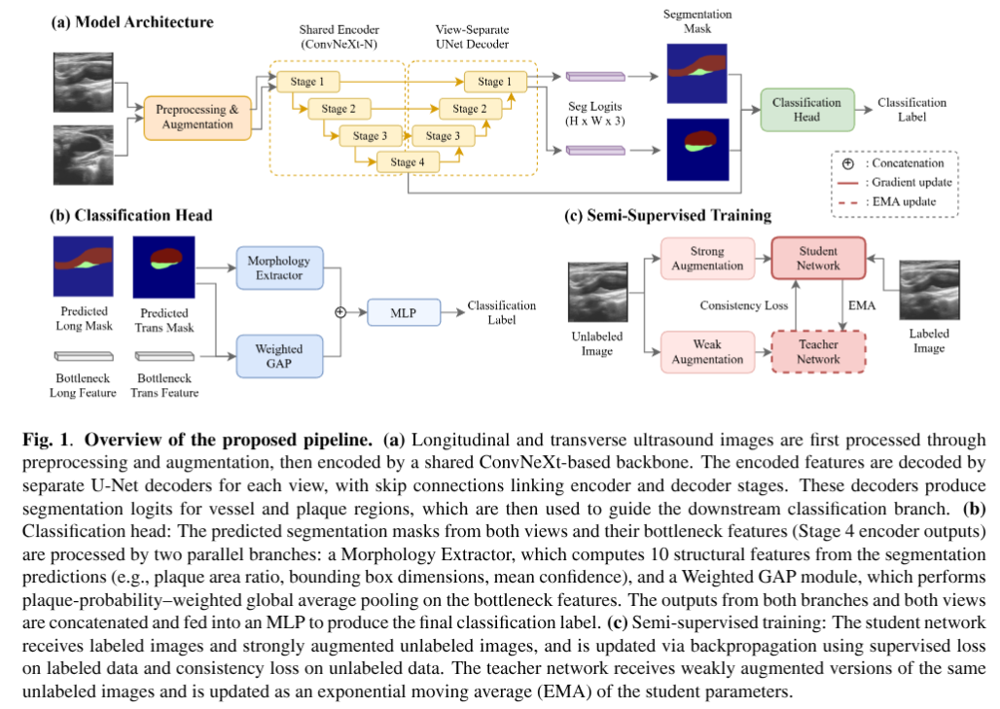

# ISBI 2026 CSV Challenge 4th Place Solution

[](https://huggingface.co/yws0322/csv2026)
[](https://hub.docker.com/r/yws0322/csv2026-lpsib-solution)

This repository contains the 4th place solution for the [CSV 2026 Challenge: Carotid Plaque Segmentation and Vulnerability Assessment in Ultrasound](http://119.29.231.17/index.html).

## Challenge Overview

The CSV 2026 challenge requires jointly solving two tasks on carotid plaque ultrasound images with a single unified model:

1. **Segmentation**: Segment carotid plaque and vascular structures from two-view (longitudinal and transverse) US images.
2. **Classification**: Classify plaque vulnerability (low-risk: RADS 2 vs. high-risk: RADS 3–4) following the International Plaque-RADS Guidelines.

## Methods


## Environments and Requirements

> The following specs describe the environment used for training. Other configurations may work as long as the requirements are satisfied.

- **OS**: Ubuntu 22.04.5 LTS
- **CPU**: Intel Core i7-7700 @ 3.60GHz (8 cores)
- **RAM**: 62GB
- **GPU**: NVIDIA GeForce RTX 2080 Ti (11GB)
- **CUDA**: 13.0 (Driver: 580.126.09)
- **Python**: 3.10.12

1. Create and activate a virtual environment named `magnet` (Python 3.10.12). You can use either the standard `venv` or `conda`.

Option A — Using `venv`:

```bash
# create the venv (ensure Python 3.10.12 is available as `python3.10`)
python3.10 -m venv magnet
# activate the virtual environment
source magnet/bin/activate
```

Option B — Using `conda`:

```bash
# create and activate conda env (requires conda/miniconda/Anaconda)
conda create -n magnet python=3.10.12 -y
conda activate magnet
```

2. Install requirements:

```bash
pip install -r requirements.txt
```

## Dataset

The dataset is a large-scale carotid ultrasound collection containing 1,500 paired cases, each consisting of longitudinal and transverse B-mode images.

**Split**

| Split | Cases | Labeled |
|-------|:------:|:--------:|
| Train | 1,000 | 200 (20%) |
| Validation | 200 | - |
| Test | 300 | - |

**Folder Structure**

```
train/
├── images/               # 001.h5, 002.h5, ...
│   └── *.h5
│       ├── long_image   # [512, 512, 1] — longitudinal B-mode
│       └── trans_image  # [512, 512, 1] — transverse B-mode
├── labels/               # 001_label.h5, 002_label.h5, ...
│   └── *_label.h5
│       ├── long_mask    # [512, 512] — longitudinal segmentation mask
│       ├── trans_mask   # [512, 512] — transverse segmentation mask
│       └── label        # 0: low-risk (RADS 2), 1: high-risk (RADS 3–4)
└── train.txt            # list of training file names
```

## Configuration
The global settings are managed within the `DEFAULT_CFG` dictionary in `train.py`. Below are the key categories:

**Data & Paths**
- `data_root`: Path to your training dataset (default: ./CSV2026_Dataset_Train).
- `split_json`: Path to the 4-fold cross-validation split file.
- `n_folds`: Total number of folds for cross-validation.
- `checkpoint_dir_prefix`: Prefix for the directories where model weights and logs are saved.

**Architecture & Optimization**
- `convnext_model`: Backbone variant (default: convnext_nano).
- `img_size`: Input image dimensions.
- `encoder_freeze_epochs`: Duration of initial encoder freeze.
- `early_stopping_patience`: Threshold for early termination.
 - `pretrained_encoder`: If `True`, load pretrained weights for the ConvNeXt backbone (via `timm`, typically ImageNet-pretrained). Note: the custom shallow `stem` and segmentation/classification heads are initialized separately and not replaced by the backbone pretrained weights.

**Mean Teacher (Semi-Supervised Learning)**
- `use_mean_teacher`: Enables the semi-supervised consistency
- `ema_alpha`: The decay rate for the Teacher model update.
- `consistency_weight`: Scale for the consistency loss.
- `consistency_rampup_epochs`: Period to scale up consistency loss.
- `consistency_confidence_threshold`: Minimum confidence for segmentation consistency.
- `consistency_cls_confidence_threshold`: Minimum confidence for classification consistency.

## Training

You can train the model using one of three options below.

To train the model, run this command:
```bash
# 1) Train a single fold (e.g. fold 0)
python train.py --fold 0

# 2) Train a specific range (e.g. folds 1, 2, 3 | end_fold is exclusive)
python train.py --start_fold 1 --end_fold 4

# 3) Full 4-Fold Cross-Validation
python train.py
```

## Inference

Inference can be performed via Python CLI or Docker.

**A. Via Python CLI**

```bash
# Example
python inference.py \
	--data-root ./CSV2026_Dataset_Val \
	--model-path ./checkpoints_convnext_unet/kfold_summary/fold_0/best_st_fold0_model.pth \
	--output-dir ./preds \
	--resize-target 512 \
	--gpu 0 \
	--cls-threshold 0.8
```
Arguments
- `--data-root`: Path to dataset.
- `--model-path`: Path to the trained `.pth` checkpoint
- `--output-dir`: Directory to save `{patient_id}_pred.h5`
- `--resize-target`: Target resolution for model input.
- `--gpu`: GPU device id
- `--cls-threshold`: Classification threshold for high-risk

**B. Via Docker**

1. Pull the image:

```bash
docker pull yws0322/csv2026-lpsib-solution
```

2. Run container:

```bash
docker run --rm --gpus all \
  -v /path/to/dataset:/data \
  -v /path/to/weights:/weights \
  -v /path/to/output:/output/preds \
  -e DATA_ROOT=/data \
  -e MODEL_PATH=/weights/best.pth \
  -e OUTPUT_DIR=/output/preds \
  -e RESIZE_TARGET=512 \
  -e GPU=0 \
  -e CLS_THRESHOLD=0.8 \
  yws0322/csv2026-lpsib-solution
```
## Results
Our method achieved 4th place on the official test leaderboard of the CSV 2026 Challenge.

|    Model   |   F1   | Segmentation | Time(ms) |
|   :----:   | :----: |    :----:    |   :----: |
|   MAGNET   |  68.03 |     60.25    |  98.52    |